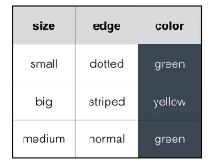

```{r setup, cache = FALSE, echo = FALSE, message = FALSE, warning = FALSE, tidy = FALSE}
# make this an external chunk that can be included in any file
require(knitr)
require(xtable)
require(ISLR)
options(xtable.comment = TRUE)
opts_chunk$set(message = F, error = F, warning = F, comment = NA, fig.align = 'center', dpi = 100, tidy = F, cache.path = '.cache/', fig.path = 'fig/')

#Add Table Captions
#table <- [OUTPUT]
#```{r echo = FALSE, results='asis'}
#print(xtable(table, caption = "caption"), comment = FALSE)
#```

```

\newpage

# Chapter 1: What is Machine Learning   
## Introduction  

__Machine Learnng:__ 

* Explores the construction and usage of algorithms. 
* Improves performance as it receives __more__ infomrtion. 
* Experience comes from observations on how particular problems have been previously solved.

No matter what algorithm used, the primary concept for Machine Learning is __imput knowledge__ or __Data__. Typically this data is a __dataset__ containing a number of observations, each having a number of well defined variables (often called features) :



From the figure above, we see that each square (row) and its corresponding color is an __observations__. The __features__ in this case are the `size` and `edge` and the `color` is the __label__. In a __R__, the `data.frame()` function is used to depict the dataset above. 

```{r data, echo = TRUE, results = 'asis'}
squares <- data.frame(size = c("small", "big", "medium"),
                      edge = c("dotted", "stripped", "normal"),
                      color = c("green", "yellow", "green"))
print(xtable(squares, caption = "The dataset as a data.rame"), comment = FALSE)

```

The __observations__ correspond to the rows and the columns correspond to the __variables__. 

So the goal of Machine Learning, based on data shown in the example, is to build a __Model of Prediction__. Build a model that can help make predictions about the data for future instances of similar problems. But before the model can be built, one firstly has to acquaint themselves with the Data. The following Excercises deomstrate this process.

### Exercise 1: Getting acquanted with data 

As a first step, we will find out some properties of the dataset with which we will be working. More specifically, we want to know mre about the dataset's number of observations and variables. To do this, we will explore the `iris` dataset. 

#### Instructions:

* Use the two ways presented in the video to find out the number of observations and variables of the iris data set: `str()` and `dim()`. 
* Call `head()` and `tail()` on `iris` to reveal the first and last observations in the iris dataset. 
* Finally, call the `summary()` function to generate a summary of the dataset. What does the printout reveal?

#### Results:

```{r exercise1_1, echo= TRUE}
# The iris is available from the datasets package and is loaded by default
# Reveal number of observations and variables by looking at the structure
str(iris)

# Reveal number of observations and variables by looking at the dimensions
dim(iris)

# Show first and last observations in the iris data set
head(iris)
tail(iris)

# Summarize the iris data set
summary(iris)

```

### Exercise 2: Basic Prediction Model  

To examine a first take a using Machine Learning to make a prediction, we will be using the `Wage` dataset. This dataset contains the wage and some general informaiton for workers in the mid-Atlanic regions of the United States and there could be some relationship between the `age` of a worker and his/her `wage`. Older workers tend to earn more on average than their younger counterparts, hence one could expect an increasing trend in wage as workers age. So we build a linear regression model for you, using the `lm()` function to model the wage of a worker based on his/her age.

With a linear model `lm_wage`, that is built with previous observations, one can predict the wage of new observations. For example, suppose we want to predict the wage of a 60 year old worker. We can use the `predict()` function for this. This generic function takes a model as the first argument. The second argument should be some unseen observations as a data frame. The `predict()` function is then able to predict outcomes for these observations.

#### Instructions:

* Build a Linear Model called `lm_wage`, that models the `wage` by the `age` variable. 
* Create a single colum data frame called `unseen`, with a single column called `age`, containing a single value of `60`. 
* Predict the average wage at age 60 using the `predict()` function.

#### Results:

```{r exercise1_2, echo = TRUE}
# The Wage dataset is already loaded from the outset.
# Build a Linear Model called lm_wage
lm_wage <- lm(wage ~ age, data = Wage)

# Create a data frame for an unseen age (60)
unseen <- data.frame(age = 60)

# Predict the wage of a 60 year old worker
result <- predict(lm_wage, unseen)

```

The Average wage of a 60 year old worker is __`r round(result, digits = 2)` USD__ per day. 

## Classification, Regression and Clustering  

In the majority of Machine Learning problems involve __Classification__, __Regression__ and __Clustering__. 

* A classification problem involves predicting whether a given observation belongs to a certain catagory. What's important to remember regaridng Classification problems, is that the output is __Qualitative__ and the possible classes to which a new observation can belong, are known beforehand (Predefined Classes). 
* A Regression problem involves predicting a continuous, quantitative value based on previous information. The input value are refered to as __Predictors__ and the outout is the __Response__. Regression is somehat simmilar to Classification in that it tries to estimate a funciton that maps the input to the output based on earlier observations, except that the estimate is an actual value. See [Appendix A: Regression Coefficients][]. What's important to remember is that the reponse is ALWAYS __Quantitative__ and the model can only be built with input knowledge of previous input/output observations. 
*  A Clustering problem involves tring to group `similar` observations into clusters, while making sure the clusters thmselves are `dissimilar`. Clustering is similar to Classification, but without saying to wich class the observations have  to belong, therfore no previous knowledge regaring the labels is required.

### Example 3: Classification for Filtering Spam

Filtering spam from relevant emails is a typical machine learning task. Information such as word frequency, character frequency and the amount of capital letters can indicate whether an email is spam or not. In the following exercise we work with the dataset `emails` from the [UCI Machine Learning Repository](http://s3.amazonaws.com/assets.datacamp.com/course/intro_to_ml/emails_small.csv). Here, several emails have been labeled by humans as spam (1) or not spam (0) and the results are found in the column `spam`. The considered feature in `emails` is `avg_capital_seq`. It is the average amount of sequential capital letters found in each email. Crete a very basic spamfilter, `spam_classifier()` that uses `avg_capital_seq` to predict whether an email is spam or not. Inspect the `emails` dataset, apply `spam_classifier()` to it and compare the outcome with the true labels. 

#### Instructions:

* Check the dimensions of this dataset, use `dim()`.
* Create the `spam_classifier()` function as a simple set of statements that decide between spam and no spam based on a single input vector.
* Pass the `avg_capital_seq` column of emails to `spam_classifier()` to determine which emails are spam and which aren't and assign the resulting outcomes to `spam_pred`.
* Compare the prediction, `spam_pred`, to the true spam labels in `emails` and print out the result. How many of the emails were correctly classified?

#### Results:

```{r exercise1_3, echo = TRUE}
# Load the emails dataset into the workspace

# Show the dimensions of emails


# Inspect definition of spam_classifier()
spam_classifier <- function(x){
  prediction <- rep(NA,length(x))
  prediction[x > 4] <- 1
  prediction[x >= 3 & x <= 4] <- 0
  prediction[x >= 2.2 & x < 3] <- 1
  prediction[x >= 1.4 & x < 2.2] <- 0
  prediction[x > 1.25 & x < 1.4] <- 1
  prediction[x <= 1.25] <- 0
  return(prediction)
}

# Apply the classifier to the avg_capital_seq column: spam_pred


# Compare spam_pred to emails$spam. Use ==


```

\newpage

# Appendix A: Regression Coefficients

As an example of trying to fit a linear function between a `Predictor` (e.g. Weight) and a `Response` (e.g. Height). $$Height \approx \beta_0+\beta_1\times Weight$$ Together $\beta_1$ and $\beta_0$ are known as the model coefficients or parameters. As soon as we know what these coefficients are, the function is able to convert any new input to output. This means that solving the Machine Learning problem is to find good values for $\beta_1$ and $\beta_0$, estimated from previous input to previous output observations. 

