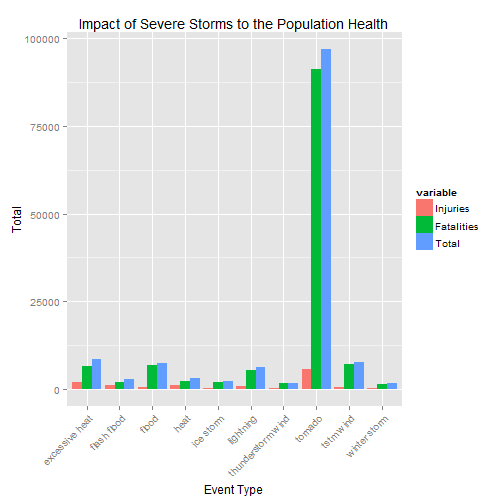
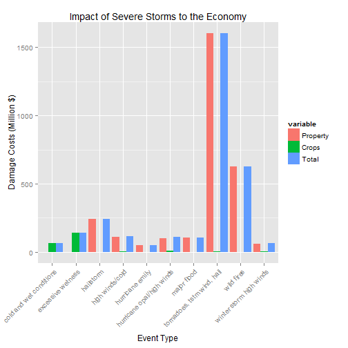

The Impact of Severe Weather on Population Health and Economy in the United States.
=========================================================================
## Synposis
The objective of this report is to provide an analysis of the consequences of severe weather, and which of these events directly impact:

1. Population Health.
2. Economy.

The analysis is derived from the U.S. National Oceanic and Atmospheric Administration's (NOAA) storm database and demonstrates the specific weather events that are directly attributed to the  most amount of human fatalities and injuries. As well as the total cost of the damages to property and crops that these storm events cause.

## Data Processing

### Downloading the data
The data is automatically downloaded, extracted to the __data__ folder within the workspace and read into R for analysis. Alternatively, the data can be manually downloaded from this [link](https://d396qusza40orc.cloudfront.net/repdata%2Fdata%2FStormData.csv.bz2).


```r
## Initialize the environment
if (!file.exists("data")) {
        dir.create("data")
}

## Download the Data
URL <- "https://d396qusza40orc.cloudfront.net/repdata%2Fdata%2FStormData.csv.bz2"
download.file(URL, "./data/stormdata.bz2", method = "curl")
downloadDate <- date()

## Read the file into R
df <- read.csv(bzfile("./data/stormdata.bz2"))
```

__Note: The analysis for this report is performed on data downloaded on Sun Jun 22 00:41:54 2014.__

### Initial Analysis
After reading the data into R, an initial analysis shows the following:


```r
## Summarize the Data
Names <- names(df)
numVariables <- dim(df)[2]
numObservations <- dim(df)[1]
numEvents <- length(unique(df$EVTYPE))
```

* There are __37__ specific features to the data. These are, 


```r
Names
```

```
##  [1] "STATE__"    "BGN_DATE"   "BGN_TIME"   "TIME_ZONE"  "COUNTY"    
##  [6] "COUNTYNAME" "STATE"      "EVTYPE"     "BGN_RANGE"  "BGN_AZI"   
## [11] "BGN_LOCATI" "END_DATE"   "END_TIME"   "COUNTY_END" "COUNTYENDN"
## [16] "END_RANGE"  "END_AZI"    "END_LOCATI" "LENGTH"     "WIDTH"     
## [21] "F"          "MAG"        "FATALITIES" "INJURIES"   "PROPDMG"   
## [26] "PROPDMGEXP" "CROPDMG"    "CROPDMGEXP" "WFO"        "STATEOFFIC"
## [31] "ZONENAMES"  "LATITUDE"   "LONGITUDE"  "LATITUDE_E" "LONGITUDE_"
## [36] "REMARKS"    "REFNUM"
```

* There are __902297__ observations in total.
* There are __985__ different types of storm events.

Since the objective is to analyze the impact of these storm events on  Population Health and Property/Crop damage, we will focus only on these variables:

* __EVTYPE__
* __FATALITIES__
* __INJURIES__
* __PROPDMG__
* __PROPDMGEXP__
* __CROPDMG__
* __CROPDMGEXP__

### Transformations to the Polulation Health Data
Firstly, we will focus on the data needed to analyse the impact of storm events on the Population Health. To do this we summarize the total number of __Injuries__ and __Fatalities__ observations, by each type of storm event. We then merge the data into a tidy data frame and calculate the total impact to the Population Health by adding these two variables together.


```r
## Create a new data frame with only the relevant data for this analysis
## Fatalities
df$EVTYPE <- tolower(df$EVTYPE)
sumFatalities <- as.data.frame(tapply(df$FATALITIES, df$EVTYPE, sum))
sumFatalities$EVTYPE <- rownames(sumFatalities)
sumFatalities$EVTYPE <- tolower(sumFatalities$EVTYPE)
colnames(sumFatalities) <- c("Injuries", "Type")
sumFatalities <- sumFatalities[, c(2, 1)]
rownames(sumFatalities) <- NULL

## Injuries
sumInjuries <- as.data.frame(tapply(df$INJURIES, df$EVTYPE, sum))
sumInjuries$EVTYPE <- rownames(sumInjuries)
sumInjuries$EVTYPE <- tolower(sumInjuries$EVTYPE)
colnames(sumInjuries) <- c("Fatalities", "Type")
sumInjuries <- sumInjuries[, c(2, 1)]
rownames(sumInjuries) <- NULL

## Merge the data to form the new data frame
PopHealthData <- merge(sumInjuries, sumFatalities)

## Add the Injuries and Fatalies totals per event type
PopHealthData$Total <- PopHealthData$Injuries + PopHealthData$Fatalities
```

### Transformations to the Economic Impact Data
Secondly, we will focus on the data needed to analyse the impact of storm events on the Economy. However, this task is a little more complicated as the __CROPDMG__ and __PROPDMG__ features simply display a value, as follows:


```r
df$PROPDMG[[1]]
```

```
## [1] 25
```

It unknown as to whether this value is in Millions or Billions of dollars. To address this, the __PROPDMGEXP__ and __CROPDMGEXP__ variables supply a key that indicates the exponential value. However, the "keys" provided within the data are not tidy, as can be seen from the following list of keys.


```r
## View EXP classifcations for Property Damage
levels(df$PROPDMGEXP)
```

```
##  [1] ""  "-" "?" "+" "0" "1" "2" "3" "4" "5" "6" "7" "8" "B" "h" "H" "K"
## [18] "m" "M"
```
The code book provided with the data set does not provide a definition for what some of these values mean. Added to this is the fact that some of the keys don't correlate to any data, as can be seen from the following output:


```r
## Example of a meaningless EXP factor
df$PROPDMG[df$PROPDMGEXP == "8"]
```

```
## [1] 0
```
To this end, we create a tidy set of usable exponential values. The other undefined values are discarded.


```r
## Create a vector of the relevent EXP factors
EXP <- c(B = as.integer(1000000000), b = as.integer(1000000000),
         M = as.integer(1000000), m = as.integer(1000000),
         K = as.integer(1000), k = as.integer(1000))
EXP
```

```
##          B          b          M          m          K          k 
## 1000000000 1000000000    1000000    1000000       1000       1000
```
The same methodology applied to tidying the Population Health data can then be applied to the __PROPDMG__ and __CROPDMG__ variables respectively. This will enable us to determine the total cost of the damage resulting from each type of storm event.


```r
## Add a new column to the data frame applying EXP to Property Damage
## To create a data frame for property damage
df$PROPCOST <- df$PROPDMG * EXP[as.character(df$PROPDMGEXP)]
sumPropDMG <- as.data.frame(tapply(df$PROPCOST, df$EVTYPE, sum))
sumPropDMG$EVTYPE <- rownames(sumPropDMG)
sumPropDMG$EVTYPE <- tolower(sumPropDMG$EVTYPE)
colnames(sumPropDMG) <- c("Property", "Type")
sumPropDMG <- sumPropDMG[, c(2, 1)]
rownames(sumPropDMG) <- NULL
sumPropDMG$Property[is.na(sumPropDMG$Property)] <- 0

## Apply the same methologoy for the Crop Damage Data
df$CROPCOST <- df$CROPDMG * EXP[as.character(df$CROPDMGEXP)]
sumCropDMG <- as.data.frame(tapply(df$CROPCOST, df$EVTYPE, sum))
sumCropDMG$EVTYPE <- rownames(sumCropDMG)
sumCropDMG$EVTYPE <- tolower(sumCropDMG$EVTYPE)
colnames(sumCropDMG) <- c("Crops", "Type")
sumCropDMG <- sumCropDMG[, c(2, 1)]
rownames(sumCropDMG) <- NULL
sumCropDMG$Crops[is.na(sumCropDMG$Crops)] <- 0

## Merge the data to form the new data frame
EconomicData <- merge(sumPropDMG, sumCropDMG)
EconomicData$Total <- EconomicData$Property + EconomicData$Crops
```

## Results
Now that we have the data relevant for the analysis, we can proceed to answer the questions posed at the outset, namely:

1. Across the united States, which types of events are most harmful with respect to Population Health?
2. Across the United States, which types of events have the greatest economic consequences?

### Severe Weather Impact on Population Health
From the analysis done with the __Injuries__ and __Fatalities__ observations, we can examine the Top 10 most severe Weather events impacting Population Health, as follows:


```
##                  Type Fatalities Injuries Total
## 758           tornado      91346     5633 96979
## 116    excessive heat       6525     1903  8428
## 779         tstm wind       6957      504  7461
## 154             flood       6789      470  7259
## 418         lightning       5230      816  6046
## 243              heat       2100      937  3037
## 138       flash flood       1777      978  2755
## 387         ice storm       1975       89  2064
## 685 thunderstorm wind       1488      133  1621
## 888      winter storm       1321      206  1527
```
As can bee seen from the data, Tornado's by far have the most severe impact on Population Health. This is further clarified in the following plot.


```r
## Show this via a Plot
require(plyr)
require(reshape2)
require(ggplot2)
## Prepare the data for plotting (reformatting required for qplot)
tmp1Data <- ddply(HealthTop10, .(Injuries, Fatalities), summarize,
           Total = Injuries + Fatalities)
tmp1Data <- tmp1Data[order(tmp1Data$Total, decreasing = TRUE), ]
tmp1Data$Type <- HealthTop10$Type
Plot1Data <- melt(tmp1Data, id.vars = "Type")
p1 <- qplot(x = Type, y = value, fill = variable,
           data = Plot1Data, geom = "bar", stat = "identity",
           position = "dodge") + xlab("Event Type") + ylab("Total") + 
        ggtitle("Impact of Severe Storms to the Population Health") +
        theme(axis.text.x = element_text(angle = 45, hjust = 1))
p1
```

 

### Severe Weather Impact on the Economy
From the analysis done with the __Crop Damage__ and __Property Damage__ observations, we can examine the Top 10 most severe Weather events impacting the Economic by looking at the financial impact of the damaged caused, as follows:


```r
## Summary of the Top 1- events impacting the Economy
EconomicTop10 <- EconomicData[order(EconomicData$Total, decreasing = TRUE)[1:10], ]
EconomicTop10
```

```
##                           Type  Property    Crops     Total
## 766 tornadoes, tstm wind, hail 1.600e+09 2.50e+06 1.602e+09
## 872                 wild fires 6.241e+08 0.00e+00 6.241e+08
## 239                  hailstorm 2.410e+08 0.00e+00 2.410e+08
## 122          excessive wetness 0.000e+00 1.42e+08 1.420e+08
## 353            high winds/cold 1.105e+08 7.00e+06 1.175e+08
## 371  hurricane opal/high winds 1.000e+08 1.00e+07 1.100e+08
## 437                major flood 1.050e+08 0.00e+00 1.050e+08
## 63     cold and wet conditions 0.000e+00 6.60e+07 6.600e+07
## 889    winter storm high winds 6.000e+07 5.00e+06 6.500e+07
## 366            hurricane emily 5.000e+07 0.00e+00 5.000e+07
```

As was the case with the __Injuries__ and __Fatalities__, Tornado's also have the most significant impact to __Crop Damage__ and __Property Damage__ in the total amount of cost of the damage (in Millions of Dollars). The following plot helps us to visualize just how severe the impact is when compared with other types of storm events.


```r
## Apply same methadology for Ecomonic Data
tmp2Data <- ddply(EconomicTop10, .(Property, Crops), summarize,
                  Total = Property + Crops)
tmp2Data <- tmp2Data[order(tmp2Data$Total, decreasing = TRUE), ]
tmp2Data$Type <- EconomicTop10$Type
Plot2Data <- melt(tmp2Data, id.vars = "Type")
p2 <- qplot(x = Type, y = value/1000000, fill = variable,
           data = Plot2Data, geom = "bar", stat = "identity",
           position = "dodge") + xlab("Event Type") + 
        ylab("Damage Costs (Million $)") + 
        ggtitle("Impact of Severe Storms to the Economy") + 
        theme(axis.text.x = element_text(angle = 45, hjust = 1))
p2
```

 
