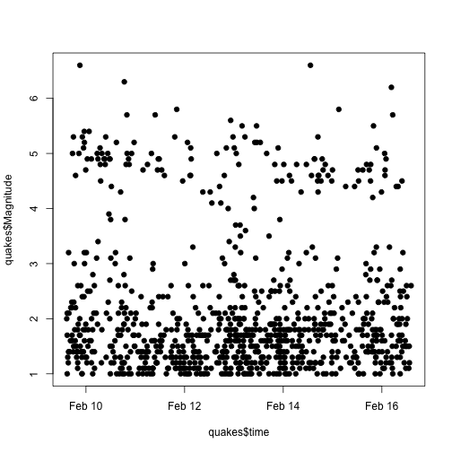
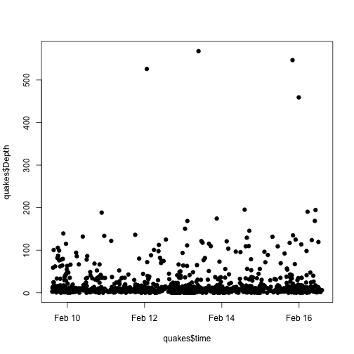
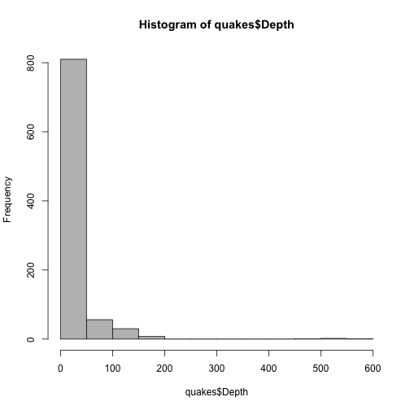
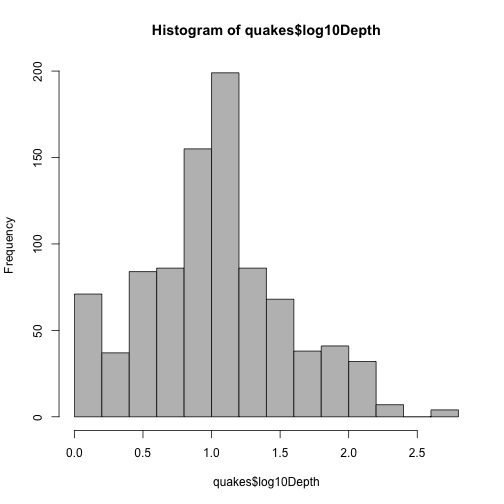
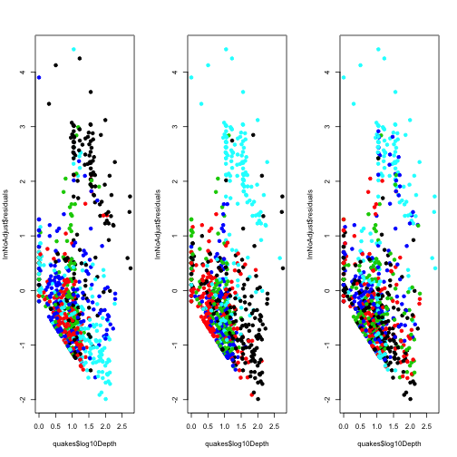
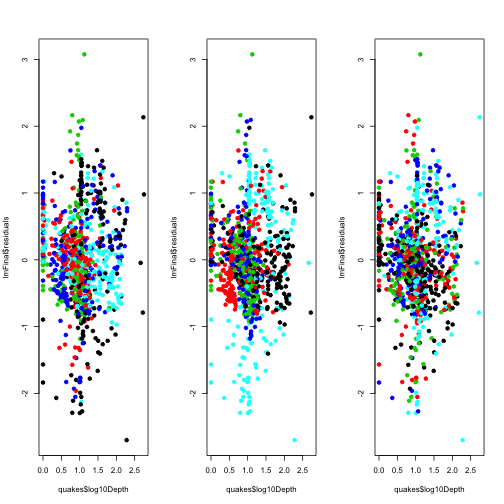

Final Earthquake Analysis
========================

Note: This analysis was created on a Mac. Some functions may be altered to be able to run on Windows machines. 

------

## Preliminaries

### Load libraries/data/create new variables


```r

# Load libraries
library(maps)
library(Hmisc)
```

```
## Loading required package: survival
```

```
## Loading required package: splines
```

```
## Hmisc library by Frank E Harrell Jr
## 
## Type library(help='Hmisc'), ?Overview, or ?Hmisc.Overview') to see overall
## documentation.
## 
## NOTE:Hmisc no longer redefines [.factor to drop unused levels when
## subsetting.  To get the old behavior of Hmisc type dropUnusedLevels().
```

```
## Attaching package: 'Hmisc'
```

```
## The following object(s) are masked from 'package:survival':
## 
## untangle.specials
```

```
## The following object(s) are masked from 'package:base':
## 
## format.pval, round.POSIXt, trunc.POSIXt, units
```

```r
library(RColorBrewer)

# Load data
load("../../data/quakesRaw.rda")

# Define relevant variables - making numeric variables into factors when
# they should be.
quakesRaw$latCut <- cut2(quakesRaw$Lat, g = 5)
quakesRaw$lonCut <- cut2(quakesRaw$Lon, g = 5)
quakesRaw$nstCut <- cut2(quakesRaw$NST, g = 5)
quakesRaw$log10Depth <- log10(quakesRaw$Depth + 1)
quakesRaw$time <- strptime(quakesRaw$Datetime, format = "%A, %B %e, %Y %H:%M:%S")

## This is the data set we will use
quakes <- quakesRaw
```


------

## Exploratory analysis

### Get minimum and maximum times and date downloaded (Methods/Data Collection)


```r
min(quakes$time)
```

```
## [1] "2013-02-09 14:37:51 CET"
```

```r
max(quakes$time)
```

```
## [1] "2013-02-16 14:13:09 CET"
```

```r
dateDownloaded
```

```
## [1] "Sat Feb 16 15:19:19 2013"
```


### Find number of missing values/check ranges (Results paragraph 1)


```r
sum(is.na(quakes))
```

```
## [1] 0
```

```r
summary(quakes)
```

```
##       Src            Eqid        Version   
##  ak     :221   00402431:  1   1      :237  
##  nc     :178   00402467:  1   2      :173  
##  nn     :160   00402515:  1   9      :168  
##  ci     :140   00402516:  1   0      :147  
##  us     :126   00402518:  1   3      : 42  
##  hv     : 21   00402527:  1   6      : 31  
##  (Other): 62   (Other) :902   (Other):110  
##                                      Datetime        Lat       
##  Thursday, February 14, 2013 00:59:20 UTC:  2   Min.   :-60.4  
##  Tuesday, February 12, 2013 04:23:40 UTC :  2   1st Qu.: 34.6  
##  Friday, February 15, 2013 00:15:34 UTC  :  1   Median : 38.0  
##  Friday, February 15, 2013 00:31:05 UTC  :  1   Mean   : 38.1  
##  Friday, February 15, 2013 00:41:47 UTC  :  1   3rd Qu.: 51.5  
##  Friday, February 15, 2013 00:43:27 UTC  :  1   Max.   : 67.9  
##  (Other)                                 :900                  
##       Lon           Magnitude        Depth            NST     
##  Min.   :-180.0   Min.   :1.00   Min.   :  0.0   Min.   :  0  
##  1st Qu.:-146.4   1st Qu.:1.30   1st Qu.:  3.8   1st Qu.: 11  
##  Median :-118.7   Median :1.70   Median :  9.5   Median : 18  
##  Mean   : -97.3   Mean   :2.16   Mean   : 22.0   Mean   : 32  
##  3rd Qu.:-116.9   3rd Qu.:2.40   3rd Qu.: 18.0   3rd Qu.: 32  
##  Max.   : 177.9   Max.   :6.60   Max.   :567.8   Max.   :654  
##                                                               
##                  Region             latCut            lonCut   
##  Nevada             :152   [-60.4,33.5):182   [-180,-149):182  
##  Northern California:116   [ 33.5,37.9):182   [-149,-122):182  
##  Central Alaska     :108   [ 37.9,38.8):181   [-122,-118):181  
##  Central California : 95   [ 38.8,60.2):182   [-118,-116):182  
##  Southern California: 76   [ 60.2,67.9]:181   [-116, 178]:181  
##  Southern Alaska    : 55                                       
##  (Other)            :306                                       
##       nstCut      log10Depth         time                    
##  [ 0, 11):202   Min.   :0.000   Min.   :2013-02-09 14:37:51  
##  [11, 16):184   1st Qu.:0.681   1st Qu.:2013-02-11 11:18:56  
##  [16, 23):172   Median :1.021   Median :2013-02-13 03:53:30  
##  [23, 39):176   Mean   :1.016   Mean   :2013-02-13 02:27:27  
##  [39,654]:174   3rd Qu.:1.279   3rd Qu.:2013-02-14 15:16:21  
##                 Max.   :2.755   Max.   :2013-02-16 14:13:09  
## 
```

Latitude, longitude are within normal ranges. Magnitude has nothing above 7, depth is within the defined range. 


### Look at patterns over time (Results paragraph 1)

```r
plot(quakes$time, quakes$Magnitude, pch = 19)
```

 

```r
plot(quakes$time, quakes$Depth, pch = 19)
```

 

There does not appear to be a time trend in either variable. 


### Look at distribution of magnitudes (Results paragraph 2)

```r
mean(quakes$Magnitude < 3)
```

```
## [1] 0.8161
```

```r
mean(quakes$Magnitude > 3 & quakes$Magnitude < 5)
```

```
## [1] 0.1222
```

Most earthquakes are small (< 3) or medium (>3 and < 5)

### Look at distribution of depths (Results paragraph 2)


```r
hist(quakes$Depth, col = "grey")
```

 

```r
hist(quakes$log10Depth, col = "grey")
```

 


-------

## Modeling 

### Fit a model with no adjustment (results - paragraph 3)


```r
# Fit model with no adjustment variable
lmNoAdjust <- lm(quakes$Magnitude ~ quakes$log10Depth)

# Plot residuals, colored by different variables (latitude, longitude,
# number of sites observing the quake)
par(mfrow = c(1, 3))
plot(quakes$log10Depth, lmNoAdjust$residuals, col = quakes$latCut, pch = 19)
plot(quakes$log10Depth, lmNoAdjust$residuals, col = quakes$lonCut, pch = 19)
plot(quakes$log10Depth, lmNoAdjust$residuals, col = quakes$nstCut, pch = 19)
```

 

It appears there are some non-random patterns here.


### Now fit a model with factor adjustment for latitude, longitude, and number of sites (results - paragraph 3)


```r
lmFinal <- lm(quakes$Magnitude ~ quakes$log10Depth + quakes$latCut + quakes$lonCut + 
    quakes$NST)
par(mfrow = c(1, 3))
plot(quakes$log10Depth, lmFinal$residuals, col = quakes$latCut, pch = 19)
plot(quakes$log10Depth, lmFinal$residuals, col = quakes$lonCut, pch = 19)
plot(quakes$log10Depth, lmFinal$residuals, col = quakes$nstCut, pch = 19)
```

 

Still some clumpiness of color, but much better than it was. 

## Get the estimates and confidence intervals


```r
## The estimate from summary
summary(lmFinal)
```

```
## 
## Call:
## lm(formula = quakes$Magnitude ~ quakes$log10Depth + quakes$latCut + 
##     quakes$lonCut + quakes$NST)
## 
## Residuals:
##    Min     1Q Median     3Q    Max 
## -2.698 -0.422 -0.029  0.405  3.075 
## 
## Coefficients:
##                           Estimate Std. Error t value Pr(>|t|)    
## (Intercept)                1.65302    0.12038   13.73  < 2e-16 ***
## quakes$log10Depth          0.38663    0.05298    7.30  6.4e-13 ***
## quakes$latCut[ 33.5,37.9) -0.46745    0.10042   -4.65  3.7e-06 ***
## quakes$latCut[ 37.9,38.8) -0.03015    0.10113   -0.30   0.7657    
## quakes$latCut[ 38.8,60.2) -0.19137    0.09740   -1.96   0.0498 *  
## quakes$latCut[ 60.2,67.9] -0.39651    0.10093   -3.93  9.2e-05 ***
## quakes$lonCut[-149,-122)  -0.27613    0.08554   -3.23   0.0013 ** 
## quakes$lonCut[-122,-118)  -0.23062    0.11265   -2.05   0.0409 *  
## quakes$lonCut[-118,-116)  -0.48773    0.11241   -4.34  1.6e-05 ***
## quakes$lonCut[-116, 178]   1.19645    0.09881   12.11  < 2e-16 ***
## quakes$NST                 0.00897    0.00052   17.26  < 2e-16 ***
## ---
## Signif. codes:  0 '***' 0.001 '**' 0.01 '*' 0.05 '.' 0.1 ' ' 1 
## 
## Residual standard error: 0.718 on 897 degrees of freedom
## Multiple R-squared: 0.668,	Adjusted R-squared: 0.664 
## F-statistic:  180 on 10 and 897 DF,  p-value: <2e-16
```

```r

## The confidence interval from confint
confint(lmFinal)
```

```
##                               2.5 %    97.5 %
## (Intercept)                1.416763  1.889283
## quakes$log10Depth          0.282653  0.490608
## quakes$latCut[ 33.5,37.9) -0.664541 -0.270354
## quakes$latCut[ 37.9,38.8) -0.228630  0.168336
## quakes$latCut[ 38.8,60.2) -0.382530 -0.000204
## quakes$latCut[ 60.2,67.9] -0.594593 -0.198433
## quakes$lonCut[-149,-122)  -0.444023 -0.108240
## quakes$lonCut[-122,-118)  -0.451707 -0.009536
## quakes$lonCut[-118,-116)  -0.708349 -0.267114
## quakes$lonCut[-116, 178]   1.002532  1.390364
## quakes$NST                 0.007954  0.009995
```


-------

## Figure making

```r
lmNoAdjust <- lm(quakes$Magnitude ~ quakes$log10Depth)

## Set up a function that makes colors prettier
mypar <- function(a = 1, b = 1, brewer.n = 8, brewer.name = "Dark2", ...) {
    par(mar = c(2.5, 2.5, 1.6, 1.1), mgp = c(1.5, 0.5, 0))
    par(mfrow = c(a, b), ...)
    palette(brewer.pal(brewer.n, brewer.name))
}

## Set size of axes
cx = 1.3

## Save figure to pdf file
pdf(file = "../../figures/finalfigure.pdf", height = 4, width = 3 * 4)
mypar(mfrow = c(1, 3))

hist(quakes$Depth, breaks = 100, col = 1, xlab = "Depth (km)", ylab = "Frequency", 
    main = "", cex.axis = cx, cex.lab = cx)
plot(quakes$log10Depth, lmNoAdjust$residuals, col = quakes$latCut, pch = 19, 
    xlab = "Log Base 10 Depth (km)", ylab = "No Adjustment Residuals", cex.axis = cx, 
    cex.lab = cx)
plot(quakes$log10Depth, lmFinal$residuals, col = quakes$latCut, pch = 19, xlab = "Log Base 10 Depth (km)", 
    ylab = "Full Model Residuals", cex.axis = cx, cex.lab = cx)
```

