Raw Earthquake Analysis
========================

------

### Load libraries


```r
library(maps)
library(Hmisc)
```

```
## Loading required package: survival
```

```
## Loading required package: splines
```

```
## Hmisc library by Frank E Harrell Jr
## 
## Type library(help='Hmisc'), ?Overview, or ?Hmisc.Overview') to see overall
## documentation.
## 
## NOTE:Hmisc no longer redefines [.factor to drop unused levels when
## subsetting.  To get the old behavior of Hmisc type dropUnusedLevels().
```

```
## Attaching package: 'Hmisc'
```

```
## The following object(s) are masked from 'package:survival':
## 
## untangle.specials
```

```
## The following object(s) are masked from 'package:base':
## 
## format.pval, round.POSIXt, trunc.POSIXt, units
```


------

## Processing

Download the data, read the data in and save the raw data as an RDA file


```r
getwd()
```

```
## [1] "/Users/rahimdelaviz/Coursera/DataAnalysis/exampleProject/exampleProject/code/rawcode"
```

```r
download.file("http://earthquake.usgs.gov/earthquakes/catalogs/eqs7day-M1.txt", 
    destfile = "../../data/earthquakes.csv", method = "curl")
dateDownloaded <- date()
dateDownloaded
```

```
## [1] "Sat Feb 16 15:19:19 2013"
```

```r
quakesRaw <- read.csv("../../data/earthquakes.csv")
save(quakesRaw, dateDownloaded, file = "../../data/quakesRaw.rda")
```


### Look at the data set


```r
head(quakesRaw)
```

```
##   Src     Eqid Version                                 Datetime   Lat
## 1  ci 11245402       0 Saturday, February 16, 2013 14:13:09 UTC 34.17
## 2  nc 71938615       0 Saturday, February 16, 2013 13:23:39 UTC 37.63
## 3  ci 11245394       0 Saturday, February 16, 2013 13:19:27 UTC 36.10
## 4  nc 71938595       0 Saturday, February 16, 2013 13:06:35 UTC 38.77
## 5  ak 10657129       1 Saturday, February 16, 2013 12:50:08 UTC 61.36
## 6  nc 71938570       1 Saturday, February 16, 2013 12:23:35 UTC 36.78
##      Lon Magnitude Depth NST                       Region
## 1 -116.8       2.6   6.2 139          Southern California
## 2 -119.0       1.2   5.3  19 Long Valley area, California
## 3 -117.7       1.5   1.9  26           Central California
## 4 -122.7       1.1   2.5  12          Northern California
## 5 -151.2       1.5   4.6  11              Southern Alaska
## 6 -121.4       2.0   9.8  29           Central California
```

```r
summary(quakesRaw)
```

```
##       Src            Eqid        Version   
##  ak     :221   00402431:  1   1      :237  
##  nc     :178   00402467:  1   2      :173  
##  nn     :160   00402515:  1   9      :168  
##  ci     :140   00402516:  1   0      :147  
##  us     :126   00402518:  1   3      : 42  
##  hv     : 21   00402527:  1   6      : 31  
##  (Other): 62   (Other) :902   (Other):110  
##                                      Datetime        Lat       
##  Thursday, February 14, 2013 00:59:20 UTC:  2   Min.   :-60.4  
##  Tuesday, February 12, 2013 04:23:40 UTC :  2   1st Qu.: 34.6  
##  Friday, February 15, 2013 00:15:34 UTC  :  1   Median : 38.0  
##  Friday, February 15, 2013 00:31:05 UTC  :  1   Mean   : 38.1  
##  Friday, February 15, 2013 00:41:47 UTC  :  1   3rd Qu.: 51.5  
##  Friday, February 15, 2013 00:43:27 UTC  :  1   Max.   : 67.9  
##  (Other)                                 :900                  
##       Lon           Magnitude        Depth            NST     
##  Min.   :-180.0   Min.   :1.00   Min.   :  0.0   Min.   :  0  
##  1st Qu.:-146.4   1st Qu.:1.30   1st Qu.:  3.8   1st Qu.: 11  
##  Median :-118.7   Median :1.70   Median :  9.5   Median : 18  
##  Mean   : -97.3   Mean   :2.16   Mean   : 22.0   Mean   : 32  
##  3rd Qu.:-116.9   3rd Qu.:2.40   3rd Qu.: 18.0   3rd Qu.: 32  
##  Max.   : 177.9   Max.   :6.60   Max.   :567.8   Max.   :654  
##                                                               
##                  Region   
##  Nevada             :152  
##  Northern California:116  
##  Central Alaska     :108  
##  Central California : 95  
##  Southern California: 76  
##  Southern Alaska    : 55  
##  (Other)            :306
```

```r
sapply(quakesRaw[1, ], class)
```

```
##       Src      Eqid   Version  Datetime       Lat       Lon Magnitude 
##  "factor"  "factor"  "factor"  "factor" "numeric" "numeric" "numeric" 
##     Depth       NST    Region 
## "numeric" "integer"  "factor"
```


### Find out about missing values

```r
sum(is.na(quakesRaw))
```

```
## [1] 0
```


### Find minimum and maximum times

```r
timeF = strptime(quakesRaw$Datetime, format = "%A, %B %e, %Y %H:%M:%S")
min(timeF)
```

```
## [1] "2013-02-09 14:37:51 CET"
```

```r
max(timeF)
```

```
## [1] "2013-02-16 14:13:09 CET"
```


------

## Exploratory analysis

### Make some univariate plots/summaries


```r
hist(quakesRaw$Magnitude, breaks = 100)
```

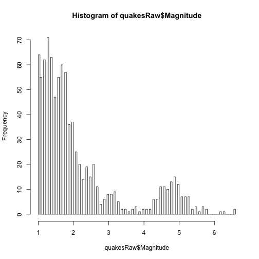 

```r
quantile(quakesRaw$Magnitude)
```

```
##   0%  25%  50%  75% 100% 
##  1.0  1.3  1.7  2.4  6.6
```

```r
hist(quakesRaw$Depth, breaks = 100)
```

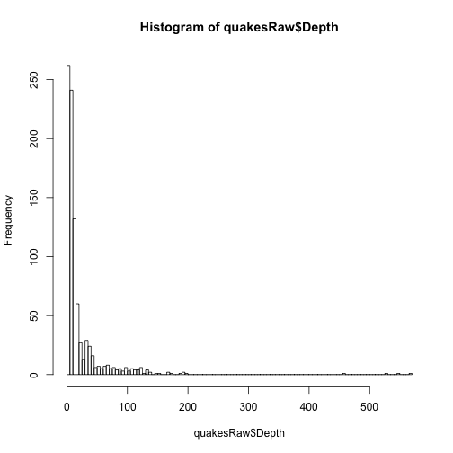 

```r
quantile(quakesRaw$Depth)
```

```
##    0%   25%   50%   75%  100% 
##   0.0   3.8   9.5  18.0 567.8
```

```r
hist(quakesRaw$Lat, breaks = 100)
```

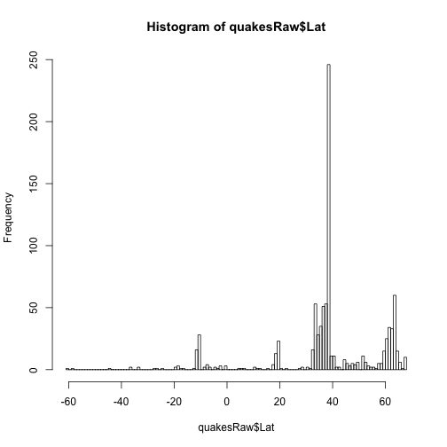 

```r
hist(quakesRaw$Lon, breaks = 100)
```

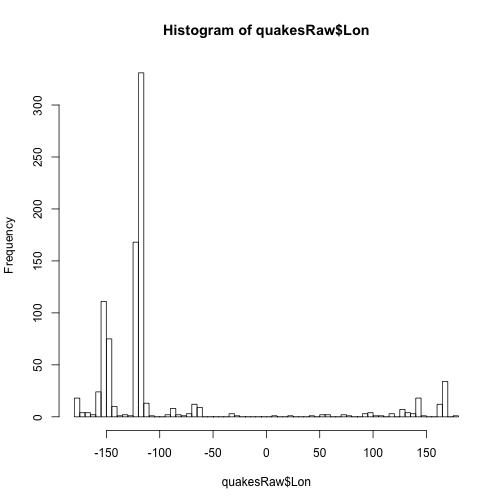 


### Make some univariate tables

```r
table(quakesRaw$Src)
```

```
## 
##  ak  ci  hv  mb  nc  nm  nn  pr  us  uu  uw 
## 221 140  21   3 178   7 160  19 126  12  21
```

```r
table(quakesRaw$Version)
```

```
## 
##   0   1   2   3   4   5   6   7   8   9   A   B   E   G 
## 147 237 173  42  26  22  31  20  25 168  10   5   1   1
```

```r
table(quakesRaw$Region)
```

```
## 
##                                       Alaska Peninsula 
##                                                      4 
##            Andreanof Islands, Aleutian Islands, Alaska 
##                                                     13 
##                                               Arkansas 
##                                                      2 
##                                         Atacama, Chile 
##                                                      1 
##                                Baja California, Mexico 
##                                                      7 
##                                              Banda Sea 
##                                                      2 
##                            Bonin Islands, Japan region 
##                                                      1 
##                               British Columbia, Canada 
##                                                      5 
##                                         Central Alaska 
##                                                    108 
##                                     Central California 
##                                                     95 
##                                   Ceram Sea, Indonesia 
##                                                      1 
##                                             Costa Rica 
##                                                      1 
##                                     Dominican Republic 
##                                                      1 
##                                            Fiji region 
##                                                      4 
##                                             Flores Sea 
##                                                      1 
##                               Flores region, Indonesia 
##                                                      1 
##                  Fox Islands, Aleutian Islands, Alaska 
##                                                      5 
##                   Greater Los Angeles area, California 
##                                                     16 
##                                                 Greece 
##                                                      1 
##                                         Gulf of Alaska 
##                                                      2 
##                                  Hawaii region, Hawaii 
##                                                      1 
##                               Island of Hawaii, Hawaii 
##                                                     19 
##                                         Jamaica region 
##                                                      1 
##                                        Java, Indonesia 
##                                                      1 
##                                Kenai Peninsula, Alaska 
##                                                     18 
##                             Kepulauan Babar, Indonesia 
##                                                      1 
##                        Kepulauan Barat Daya, Indonesia 
##                                                      1 
##                              Kepulauan Batu, Indonesia 
##                                                      3 
##                          Kepulauan Tanimbar, Indonesia 
##                                                      1 
##                           Kodiak Island region, Alaska 
##                                                      5 
##                                          Kuril Islands 
##                                                      1 
##                                          Kyushu, Japan 
##                                                      1 
##                               Lombok region, Indonesia 
##                                                      1 
##                           Long Valley area, California 
##                                                      3 
##                                    Maui region, Hawaii 
##                                                      1 
##                                       Mid-Indian Ridge 
##                                                      1 
##                                  Mindanao, Philippines 
##                                                      1 
##                              Mona Passage, Puerto Rico 
##                                                      1 
##                                Mount Hood area, Oregon 
##                                                      1 
##                         Mount Rainier area, Washington 
##                                                      1 
##                                                 Nevada 
##                                                    152 
##                                            North Korea 
##                                                      1 
##                                    Northern California 
##                                                    116 
##                                                 Oregon 
##                                                      3 
##                                       Papua, Indonesia 
##                                                      1 
##                                            Puerto Rico 
##                                                      3 
##                                     Puerto Rico region 
##                                                      5 
##                         Puget Sound region, Washington 
##                                                      3 
##                                        Reykjanes Ridge 
##                                                      1 
##                                  Ryukyu Islands, Japan 
##                                                      1 
##                                       Salta, Argentina 
##                                                      1 
##                San Diego County urban area, California 
##                                                      1 
##                     San Francisco Bay area, California 
##                                                      6 
##                                     Santa Cruz Islands 
##                                                     34 
##                              Santa Cruz Islands region 
##                                                     11 
##                                             Scotia Sea 
##                                                      1 
##                                       Seram, Indonesia 
##                                                      1 
##                                     South Indian Ocean 
##                                                      1 
##                          South Sandwich Islands region 
##                                                      1 
##                                    Southeastern Alaska 
##                                                      4 
##                                        Southern Alaska 
##                                                     55 
##                                    Southern California 
##                                                     76 
##                                              Tennessee 
##                                                      4 
##                                                  Tonga 
##                                                      3 
##                           Unimak Island region, Alaska 
##                                                      1 
##                                                   Utah 
##                                                      6 
##                                     Uttaranchal, India 
##                                                      1 
##                        Vancouver Island, Canada region 
##                                                      1 
##                                  Virgin Islands region 
##                                                      8 
##                                             Washington 
##                                                      7 
##                                        West Chile Rise 
##                                                      1 
##                           Xizang-Qinghai border region 
##                                                      1 
##                     Yellowstone National Park, Wyoming 
##                                                      6 
##                                     central Kazakhstan 
##                                                      1 
##                             central Mid-Atlantic Ridge 
##                                                      1 
##                                         eastern Turkey 
##                                                      1 
##                            near the coast of Nicaragua 
##                                                      1 
##                   near the east coast of Honshu, Japan 
##                                                      6 
## near the east coast of the Kamchatka Peninsula, Russia 
##                                                      1 
##               near the south coast of Papua, Indonesia 
##                                                      1 
##                            north of the Virgin Islands 
##                                                      1 
##                                      northeastern Iran 
##                                                      2 
##                             northeastern Sakha, Russia 
##                                                     10 
##                                        northern Alaska 
##                                                      7 
##                                         northern Idaho 
##                                                      1 
##                                northern Qinghai, China 
##                                                      1 
##                            off the coast of Costa Rica 
##                                                      1 
##                    off the east coast of Honshu, Japan 
##                                                      2 
##  off the east coast of the North Island of New Zealand 
##                                                      1 
##                 off the west coast of northern Sumatra 
##                                                      1 
##                            offshore Central California 
##                                                      2 
##                               offshore Chiapas, Mexico 
##                                                      1 
##                           offshore Northern California 
##                                                      4 
##                              offshore Sucre, Venezuela 
##                                                      1 
##                             offshore Valparaiso, Chile 
##                                                      2 
##                          south of the Aleutian Islands 
##                                                      1 
##                                  southeastern Missouri 
##                                                      1 
##                                       southern Algeria 
##                                                      1 
##                                          southern Iran 
##                                                      1 
##                                southern Qinghai, China 
##                                                      1 
##                            southern Sumatra, Indonesia 
##                                                      1 
##                                        western Montana 
##                                                      2
```

```r
length(unique(quakesRaw$NST))
```

```
## [1] 124
```

```r
length(unique(quakesRaw$Eqid))
```

```
## [1] 908
```


### Plot the earthquakes on the globe

```r
map("world")
points(quakesRaw$Lon, quakesRaw$Lat, pch = 19, col = "blue")
```

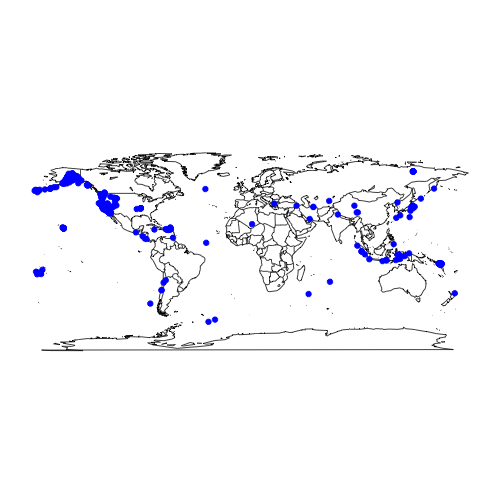 


### Plot the earthquakes on the globe/sized by relative magnitude 

```r
map("world")
points(quakesRaw$Lon, quakesRaw$Lat, pch = 19, col = "blue", cex = quakesRaw$Magnitude/max(quakesRaw$Magnitude))
```

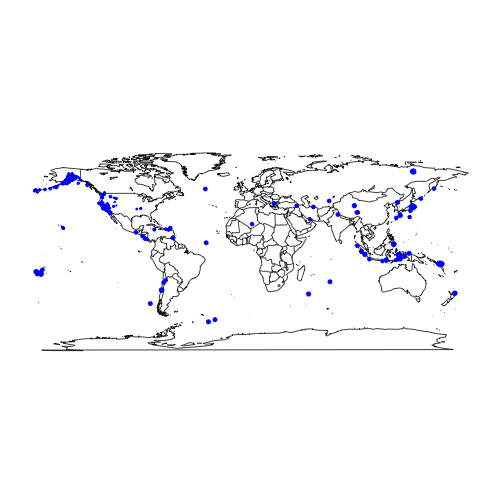 


### Plot the earthquakes on the globe/sized by relative depth

```r
map("world")
points(quakesRaw$Lon, quakesRaw$Lat, pch = 19, col = "blue", cex = quakesRaw$Depth/max(quakesRaw$Depth))
```

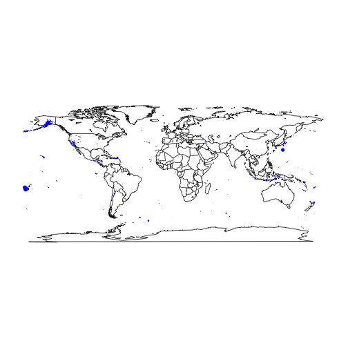 


### Plot depth versus magnitude

```r
plot(quakesRaw$Depth, quakesRaw$Magnitude, pch = 19)
```

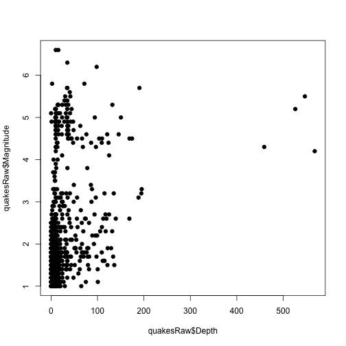 


### Looks weird, let's try a transform - need to add one to avoid log(0)

```r
summary(log10(quakesRaw$Depth), useNA = "ifany")
```

```
##    Min. 1st Qu.  Median    Mean 3rd Qu.    Max. 
##    -Inf       1       1    -Inf       1       3
```

```r
summary(log10(quakesRaw$Depth + 1))
```

```
##    Min. 1st Qu.  Median    Mean 3rd Qu.    Max. 
##   0.000   0.681   1.020   1.020   1.280   2.750
```

```r
quakesRaw$log10Depth <- log10(quakesRaw$Depth + 1)
```


### Plot w/transform

```r
plot(quakesRaw$log10Depth, quakesRaw$Magnitude, pch = 19)
```

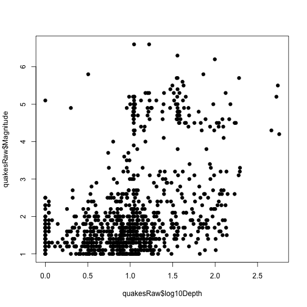 


### Color by Latitute 

```r
latCut = cut2(quakesRaw$Lat, g = 5)
plot(quakesRaw$log10Depth, quakesRaw$Magnitude, pch = 19, col = latCut)
```

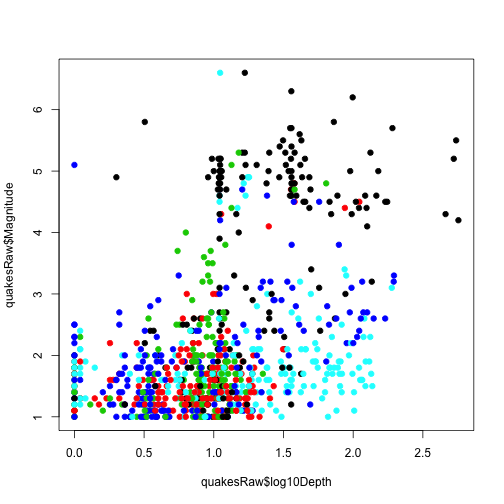 


Might be a lot of black in the top right quadrant

### Color by longitude 


```r
lonCut = cut2(quakesRaw$Lon, g = 5)
plot(quakesRaw$log10Depth, quakesRaw$Magnitude, pch = 19, col = lonCut)
```

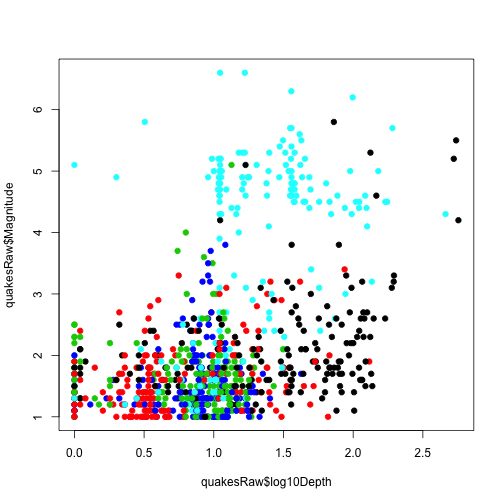 

Definitely a lot of light blue in the upper right hand quadrant


### Color by NST


```r
nstCut = cut2(quakesRaw$NST, g = 5)
plot(quakesRaw$log10Depth, quakesRaw$Magnitude, pch = 19, col = nstCut)
```

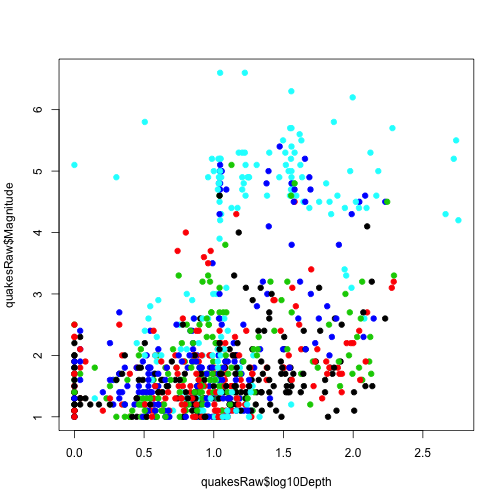 


### Check out relationship with Src

```r
boxplot(quakesRaw$log10Depth ~ quakesRaw$Src)
```

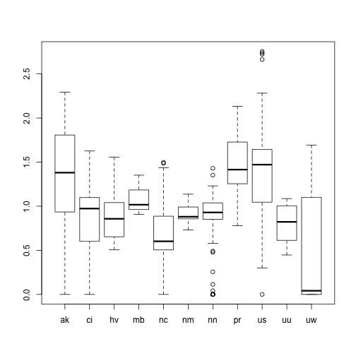 

```r
boxplot(quakesRaw$Magnitude ~ quakesRaw$Src)
```

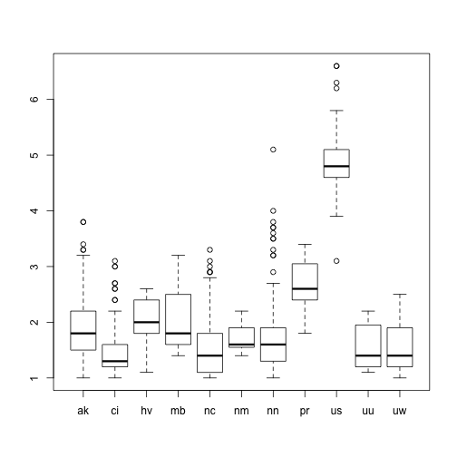 


### How do lat/lon correlated with source


```r

boxplot(quakesRaw$Lat ~ quakesRaw$Src)
```

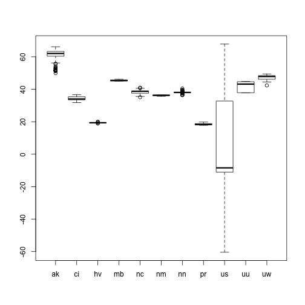 

```r
boxplot(quakesRaw$Lon ~ quakesRaw$Src)
```

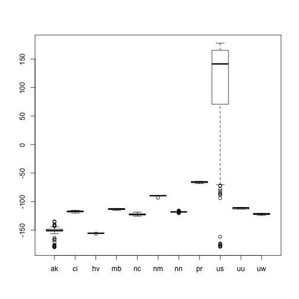 


### Get the formatted time, see earthquakes over time


```r
timeF = strptime(quakesRaw$Datetime, format = "%A, %B %e, %Y %H:%M:%S")
plot(timeF, quakesRaw$log10Depth)
```

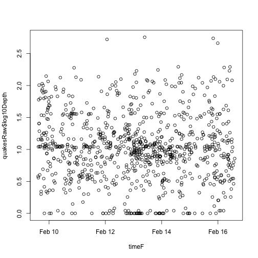 

```r
plot(timeF, quakesRaw$Magnitude)
```

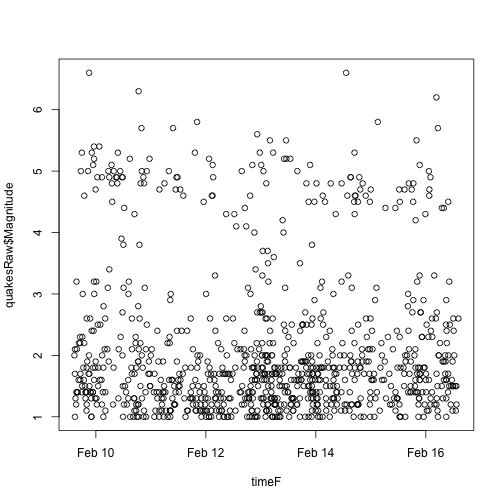 


------

## Modeling


## Fit a basic model relating depth to time


```r
lm1 <- lm(quakesRaw$Depth ~ quakesRaw$Magnitude)
summary(lm1)
```

```
## 
## Call:
## lm(formula = quakesRaw$Depth ~ quakesRaw$Magnitude)
## 
## Residuals:
##    Min     1Q Median     3Q    Max 
##  -63.5  -14.6   -7.5    0.6  522.0 
## 
## Coefficients:
##                     Estimate Std. Error t value Pr(>|t|)    
## (Intercept)            -3.01       2.86   -1.05     0.29    
## quakesRaw$Magnitude    11.61       1.15   10.10   <2e-16 ***
## ---
## Signif. codes:  0 '***' 0.001 '**' 0.01 '*' 0.05 '.' 0.1 ' ' 1 
## 
## Residual standard error: 42.9 on 906 degrees of freedom
## Multiple R-squared: 0.101,	Adjusted R-squared:  0.1 
## F-statistic:  102 on 1 and 906 DF,  p-value: <2e-16
```


## Plot the observed ('black') and fitted ('red') points


```r
lm1 <- lm(quakesRaw$Magnitude ~ quakesRaw$Depth)
plot(quakesRaw$Depth, quakesRaw$Magnitude, pch = 19)
points(quakesRaw$Depth, lm1$fitted, pch = 19, col = "red")
```

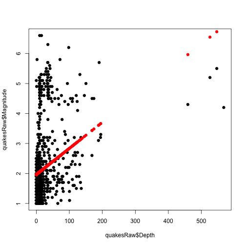 


## Look at residuals versus observations, residuals versus fitted values


```r
lm1 <- lm(quakesRaw$Magnitude ~ quakesRaw$Depth)
par(mfrow = c(1, 2))
plot(quakesRaw$Depth, lm1$residuals, pch = 19)
plot(lm1$fitted, lm1$residuals, pch = 19)
```

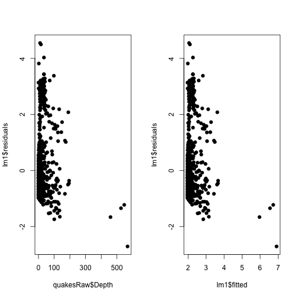 


## Try the transform


```r
lm2 <- lm(quakesRaw$Magnitude ~ quakesRaw$log10Depth)
plot(quakesRaw$log10Depth, quakesRaw$Magnitude, pch = 19)
points(quakesRaw$log10Depth, lm2$fitted, pch = 19, col = "red")
```

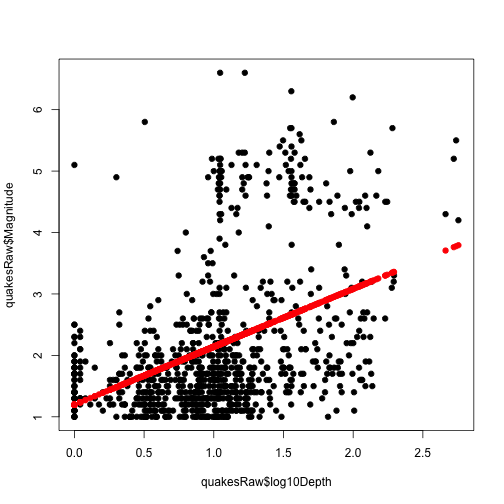 


## Plot the residuals versus the observed and fitted (little better here)


```r
lm2 <- lm(quakesRaw$Magnitude ~ quakesRaw$log10Depth)
par(mfrow = c(1, 2))
plot(quakesRaw$log10Depth, lm2$residuals, pch = 19)
plot(lm2$fitted, lm2$residuals, pch = 19)
```

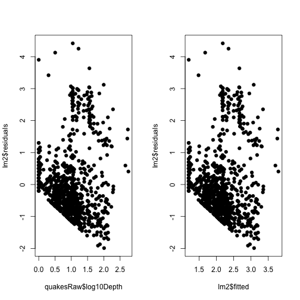 


## What if we color residuals by lat (see a pattern)


```r
lm2 <- lm(quakesRaw$Magnitude ~ quakesRaw$log10Depth)
latCut = cut2(quakesRaw$Lat, g = 5)
par(mfrow = c(1, 2))
plot(quakesRaw$log10Depth, lm2$residuals, pch = 19, col = latCut)
plot(lm2$fitted, lm2$residuals, pch = 19, col = latCut)
```

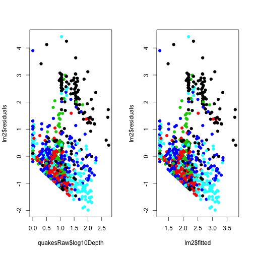 


## What if we color residuals by lon (see a pattern)


```r
lm2 <- lm(quakesRaw$Magnitude ~ quakesRaw$log10Depth)
lonCut = cut2(quakesRaw$Lon, g = 5)
par(mfrow = c(1, 2))
plot(quakesRaw$log10Depth, lm2$residuals, pch = 19, col = lonCut)
plot(lm2$fitted, lm2$residuals, pch = 19, col = lonCut)
```

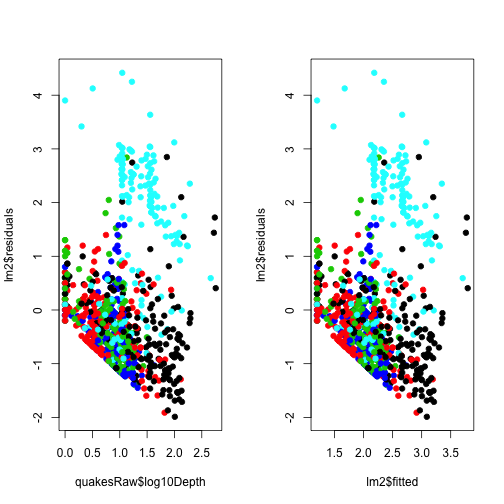 


## Now try fitting a new model with Lat in there


```r
latCut = cut2(quakesRaw$Lat, g = 5)
lm3 <- lm(quakesRaw$Magnitude ~ quakesRaw$log10Depth + latCut)
par(mfrow = c(1, 2))
plot(quakesRaw$log10Depth, lm3$residuals, pch = 19, col = latCut)
plot(lm3$fitted, lm3$residuals, pch = 19, col = latCut)
```

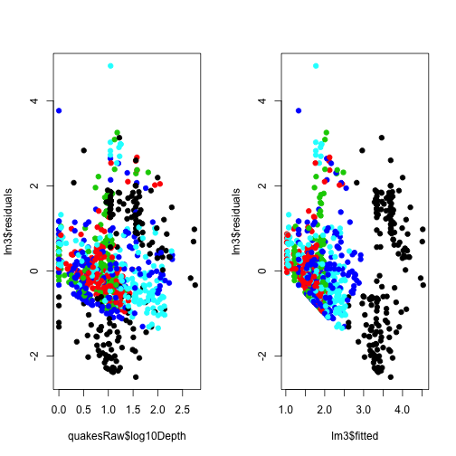 


## How about Lat/Lon


```r
latCut = cut2(quakesRaw$Lat, g = 5)
lonCut = cut2(quakesRaw$Lon, g = 5)
lm4 <- lm(quakesRaw$Magnitude ~ quakesRaw$log10Depth + latCut + lonCut)
par(mfrow = c(1, 2))
plot(quakesRaw$log10Depth, lm4$residuals, pch = 19, col = latCut)
plot(lm4$fitted, lm4$residuals, pch = 19, col = latCut)
```

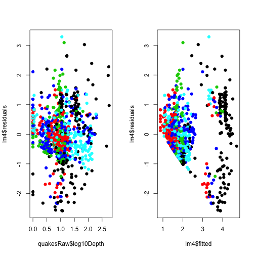 


## Color that model by NST


```r
latCut = cut2(quakesRaw$Lat, g = 5)
lonCut = cut2(quakesRaw$Lon, g = 5)
nstCut = cut2(quakesRaw$NST, g = 5)
lm4 <- lm(quakesRaw$Magnitude ~ quakesRaw$log10Depth + latCut + lonCut)
par(mfrow = c(1, 2))
plot(quakesRaw$log10Depth, lm4$residuals, pch = 19, col = nstCut)
plot(lm4$fitted, lm4$residuals, pch = 19, col = nstCut)
```

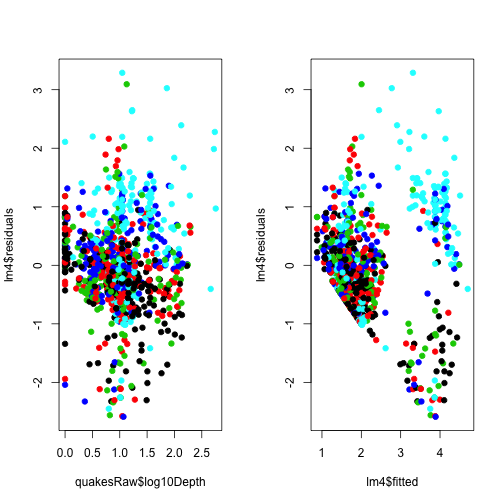 


## Include NST 


```r
latCut = cut2(quakesRaw$Lat, g = 5)
lonCut = cut2(quakesRaw$Lon, g = 5)
nstCut = cut2(quakesRaw$NST, g = 5)
lm5 <- lm(quakesRaw$Magnitude ~ quakesRaw$log10Depth + latCut + lonCut + nstCut)
par(mfrow = c(1, 2))
plot(quakesRaw$log10Depth, lm5$residuals, pch = 19, col = nstCut)
plot(lm5$fitted, lm5$residuals, pch = 19, col = nstCut)
```

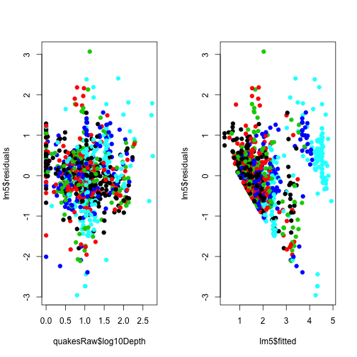 


## Let's use model 5


```r
summary(lm5)
```

```
## 
## Call:
## lm(formula = quakesRaw$Magnitude ~ quakesRaw$log10Depth + latCut + 
##     lonCut + nstCut)
## 
## Residuals:
##     Min      1Q  Median      3Q     Max 
## -2.9586 -0.4223 -0.0116  0.4393  3.0699 
## 
## Coefficients:
##                      Estimate Std. Error t value Pr(>|t|)    
## (Intercept)            1.4239     0.1303   10.93  < 2e-16 ***
## quakesRaw$log10Depth   0.3600     0.0544    6.62  6.2e-11 ***
## latCut[ 33.5,37.9)    -0.4393     0.1029   -4.27  2.2e-05 ***
## latCut[ 37.9,38.8)     0.1841     0.1066    1.73  0.08454 .  
## latCut[ 38.8,60.2)    -0.0804     0.1007   -0.80  0.42468    
## latCut[ 60.2,67.9]    -0.1305     0.1066   -1.22  0.22130    
## lonCut[-149,-122)     -0.3859     0.0882   -4.38  1.3e-05 ***
## lonCut[-122,-118)     -0.2862     0.1152   -2.48  0.01318 *  
## lonCut[-118,-116)     -0.6312     0.1157   -5.46  6.3e-08 ***
## lonCut[-116, 178]      1.2470     0.1008   12.37  < 2e-16 ***
## nstCut[11, 16)         0.2078     0.0768    2.71  0.00692 ** 
## nstCut[16, 23)         0.3025     0.0789    3.83  0.00014 ***
## nstCut[23, 39)         0.6361     0.0798    7.97  4.8e-15 ***
## nstCut[39,654]         1.2999     0.0864   15.05  < 2e-16 ***
## ---
## Signif. codes:  0 '***' 0.001 '**' 0.01 '*' 0.05 '.' 0.1 ' ' 1 
## 
## Residual standard error: 0.732 on 894 degrees of freedom
## Multiple R-squared: 0.656,	Adjusted R-squared: 0.651 
## F-statistic:  131 on 13 and 894 DF,  p-value: <2e-16
```

```r
confint(lm5)
```

```
##                         2.5 %   97.5 %
## (Intercept)           1.16818  1.67962
## quakesRaw$log10Depth  0.25326  0.46675
## latCut[ 33.5,37.9)   -0.64133 -0.23731
## latCut[ 37.9,38.8)   -0.02514  0.39333
## latCut[ 38.8,60.2)   -0.27814  0.11724
## latCut[ 60.2,67.9]   -0.33976  0.07876
## lonCut[-149,-122)    -0.55894 -0.21291
## lonCut[-122,-118)    -0.51233 -0.06005
## lonCut[-118,-116)    -0.85826 -0.40413
## lonCut[-116, 178]     1.04915  1.44492
## nstCut[11, 16)        0.05715  0.35853
## nstCut[16, 23)        0.14758  0.45742
## nstCut[23, 39)        0.47948  0.79278
## nstCut[39,654]        1.13041  1.46946
```


## Let's plot fitted versus observed magnitudes on the map


```r
par(mfrow = c(2, 1))
map("world")
lm5fitted <- lm5$fitted
points(quakesRaw$Lon, quakesRaw$Lat, pch = 19, col = "blue", cex = lm5fitted/max(lm5fitted))
map("world")
points(quakesRaw$Lon, quakesRaw$Lat, pch = 19, col = "blue", cex = quakesRaw$Magnitude/max(quakesRaw$Magnitude))
```

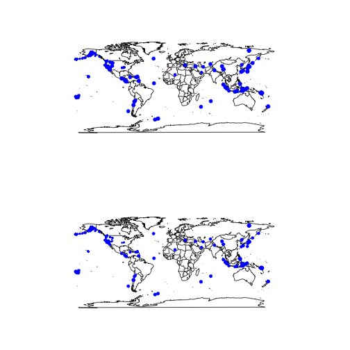 


